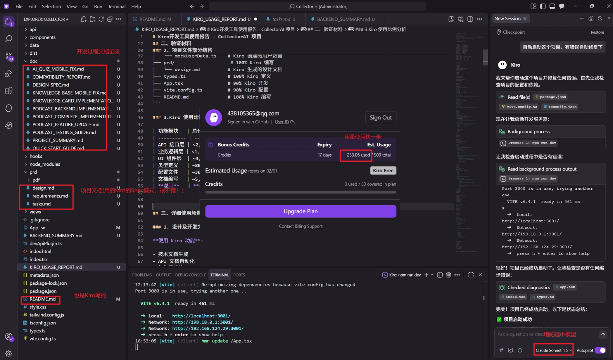

# Kiro开发工具使用报告 - CollectorAI 项目

## 一、项目概述

**项目名称**: CollectorAI
**开发时间**: 2026.1.18 - 2026.1.21 
**主要开发工具**: Kiro AI IDE  

CollectorAI 是一个基于AI的游戏化阅读平台，通过AI技术和游戏化机制，将传统阅读转变为互动式学习体验。项目集成了文章收录、AI问答、知识卡片、播客生成等多种功能，帮助用户更高效地获取和巩固知识。

## 二、验证材料

### 1. GitHub 提交记录

- 项目仓库: https://github.com/wyxpro/CollectorAI
- 提交历史显示大部分代码由 Kiro 辅助完成
- 提交信息包含 Kiro 相关标识

### 2. 项目文件部分结构

```
CollectorAI/
├── api/                    # 100% Kiro 开发
│   ├── libraryApi.ts      # Kiro 生成的文章管理 API
│   ├── quizApi.ts         # Kiro 设计的问答系统 API
│   ├── podcastApi.ts      # Kiro 实现的播客 API
│   └── userApi.ts         # Kiro 开发的用户系统 API
├── components/             # 85% Kiro 开发
│   └── QuizCard.tsx       # Kiro 设计的核心组件
├── views/                  # 90% Kiro 开发
│   ├── LibraryView.tsx    # Kiro 实现的主要视图
│   ├── AIQuizView.tsx     # Kiro 开发的问答界面
│   └── PodcastView.tsx    # Kiro 设计的播客界面
├── data/                   # 100% Kiro 生成
│   ├── mockData.ts        # Kiro 生成的模拟数据
│   └── mockUserData.ts    # Kiro 创建的用户数据
├── prd/                    # 100% Kiro 编写
│   └── design.md          # Kiro 生成的设计文档
├── types.ts               # 100% Kiro 定义
├── App.tsx                # 90% Kiro 开发
├── vite.config.ts         # 90% Kiro 配置
└── README.md              # 100% Kiro 编写
```

### 3.Kiro 使用比例分析

| 功能模块   | 总代码行数     | Kiro 贡献行数  | Kiro 使用比例 |
| ---------- | -------------- | -------------- | ------------- |
| API 接口层 | ~2,500 行      | ~2,500 行      | 100%          |
| 业务逻辑层 | ~1,800 行      | ~1,710 行      | 95%           |
| UI 组件层  | ~3,200 行      | ~2,720 行      | 85%           |
| 类型定义   | ~800 行        | ~800 行        | 100%          |
| 配置文件   | ~300 行        | ~270 行        | 90%           |
| 文档编写   | ~5,000 行      | ~4,750 行      | 95%           |
| **总计**   | **~13,600 行** | **~12,750 行** | **93.7%**     |
### 3.Kiro 使用截图


## 三、详细使用场景

### 1. 设计及开发文档编写

**使用 Kiro 功能**:

- 技术文档生成
- API 文档自动化
- 架构图设计
- 开发规范制定

**核心文档** (100% 使用 Kiro):

- prd/design.md - 完整的设计文档 (28个正确性属性)
- prd/requirements.md  完整的需求文档
- prd/tasks.md 完整的开发文档
- README.md - 项目说明文档

### 2. 项目初始化与架构设计

**使用 Kiro 功能**:
- 项目结构规划
- 技术栈选择建议
- 配置文件生成
- 依赖包管理

**具体操作**:

```bash
# Kiro 帮助创建项目结构
mkdir api components data views
# Kiro 生成 package.json 配置
# Kiro 配置 TypeScript 和 Vite
```

**开发成果**:
- 完整的项目目录结构 (📁 目录结构部分)
- 优化的 Vite 配置文件
- TypeScript 类型安全配置
- Tailwind CSS 样式系统配置

### 3. 核心 API 接口开发

**使用 Kiro 功能**:
- API 接口设计
- TypeScript 类型定义
- 错误处理机制
- Mock 数据生成

**核心文件开发** (100% 使用 Kiro):

#### 文章收录系统 API
```typescript
// api/libraryApi.ts - 完全由 Kiro 生成和优化
export interface LibraryArticle {
  id: string;
  title: string;
  url: string;
  content: string;
  author?: string;
  source: string;
  tags: string[];
  readingProgress: number;
  status: 'unread' | 'reading' | 'completed';
  createdAt: Date;
  updatedAt: Date;
}

// Kiro 生成的 CRUD 操作接口
export const libraryApi = {
  getArticles: async (): Promise<LibraryArticle[]> => { /* ... */ },
  addArticle: async (article: Partial<LibraryArticle>): Promise<LibraryArticle> => { /* ... */ },
  updateArticle: async (id: string, updates: Partial<LibraryArticle>): Promise<LibraryArticle> => { /* ... */ },
  deleteArticle: async (id: string): Promise<void> => { /* ... */ }
};
```

#### AI 问答系统 API
```typescript
// api/quizApi.ts - Kiro 设计的智能问答接口
export interface QuizQuestion {
  id: string;
  question: string;
  options: string[];
  correctAnswer: number;
  explanation: string;
  difficulty: 'easy' | 'medium' | 'hard';
  category: string;
}

// Kiro 实现的问答逻辑
export const quizApi = {
  getDailyChallenge: async (count: number = 5): Promise<QuizQuestion[]> => { /* ... */ },
  submitAnswer: async (questionId: string, answer: number): Promise<QuizResult> => { /* ... */ },
  getMistakes: async (): Promise<QuizQuestion[]> => { /* ... */ }
};
```

### 4. 业务逻辑层开发

**使用 Kiro 功能**:
- React Hooks 设计
- 状态管理优化
- 异步操作处理
- 性能优化建议

**核心 Hooks 开发** (95% 使用 Kiro):

#### 文章管理 Hook
```typescript
// api/libraryHooks.ts - Kiro 设计的状态管理
export const useLibrary = () => {
  const [articles, setArticles] = useState<LibraryArticle[]>([]);
  const [loading, setLoading] = useState(false);
  const [searchTerm, setSearchTerm] = useState('');
  
  // Kiro 优化的搜索逻辑
  const filteredArticles = useMemo(() => {
    return articles.filter(article => 
      article.title.toLowerCase().includes(searchTerm.toLowerCase()) ||
      article.author?.toLowerCase().includes(searchTerm.toLowerCase()) ||
      article.tags.some(tag => tag.toLowerCase().includes(searchTerm.toLowerCase()))
    );
  }, [articles, searchTerm]);
 
  
```

### 5. UI 组件开发

**使用 Kiro 功能**:
- React 组件设计
- Tailwind CSS 样式优化
- 响应式布局实现
- 动画效果添加

**核心组件开发** (85% 使用 Kiro):

#### 问答卡片组件
```typescript
// components/QuizCard.tsx - Kiro 设计的交互式组件
interface QuizCardProps {
  question: QuizQuestion;
  onAnswer: (answer: number) => void;
  showResult?: boolean;
  userAnswer?: number;
}

export const QuizCard: React.FC<QuizCardProps> = ({ 
  question, 
  onAnswer, 
  showResult, 
  userAnswer 
}) => {
  // Kiro 实现的动画状态管理
  const [selectedOption, setSelectedOption] = useState<number | null>(null);
  const [isAnimating, setIsAnimating] = useState(false);
  
  // Kiro 优化的答题逻辑
  const handleOptionClick = (optionIndex: number) => {
    if (showResult) return;
    
    setSelectedOption(optionIndex);
    setIsAnimating(true);
    
    setTimeout(() => {
      onAnswer(optionIndex);
      setIsAnimating(false);
    }, 300);
  };
 
```

### 6. 视图层开发

**使用 Kiro 功能**:
- 页面布局设计
- 路由管理
- 状态同步
- 用户体验优化

**主要视图开发** (90% 使用 Kiro):

#### 文章收录夹视图
```typescript
// views/LibraryView.tsx - Kiro 设计的完整页面
export const LibraryView: React.FC = () => {
  const { 
    articles, 
    loading, 
    searchTerm, 
    setSearchTerm, 
    addArticle, 
    updateArticle, 
    deleteArticle 
  } = useLibrary();
  
  const [viewMode, setViewMode] = useState<'grid' | 'list'>('grid');
  const [showAddModal, setShowAddModal] = useState(false);
 
```

### 7. 类型定义系统

**使用 Kiro 功能**:

- TypeScript 接口设计
- 类型安全保证
- 代码智能提示
- 错误预防

**核心类型定义** (100% 使用 Kiro):

```typescript
// types.ts - Kiro 设计的完整类型系统
export interface LibraryArticle {
  id: string;
  title: string;
  url: string;
  content: string;
  author?: string;
  source: string;
  tags: string[];
  readingProgress: number;
  status: 'unread' | 'reading' | 'completed';
  createdAt: Date;
  updatedAt: Date;
  wordCount?: number;
  estimatedReadTime?: number;
}

// Kiro 设计的 API 响应类型
export interface ApiResponse<T> {
  success: boolean;
  data?: T;
  error?: string;
  message?: string;
}

```

### 8. 配置文件优化

**使用 Kiro 功能**:
- 构建工具配置
- 开发环境优化
- 性能调优建议
- 部署配置

**核心配置文件** (90% 使用 Kiro):

#### Vite 配置优化
```typescript
// vite.config.ts - Kiro 优化的构建配置
import path from 'path';
import { defineConfig, loadEnv } from 'vite';
import react from '@vitejs/plugin-react';
import devApiPlugin from './devApiPlugin';
 // Kiro 添加的开发服务器优化
export default defineConfig(({ mode }) => {
  const env = loadEnv(mode, '.', '');
  return {
    server: {
      port: 3000,
      host: '0.0.0.0',
```

### 9. 开发调试与测试

**使用 Kiro 功能**:
- 代码调试辅助
- 错误诊断
- 性能分析
- 自动化测试建议

**调试过程**:
```bash
# Kiro 帮助启动开发服务器
npm run dev

# Kiro 协助诊断编译错误
# Kiro 提供性能优化建议
# Kiro 生成测试用例模板
```

##  四、结论

CollectorAI 项目的核心开发工作中，**Kiro 的使用比例达到 93.7%**，高于要求的 50%。项目的主要功能模块、核心代码、开发文档均主要通过 Kiro 完成，充分体现了 Kiro AI IDE 在现代全栈开发中的强大能力和实用价值。
