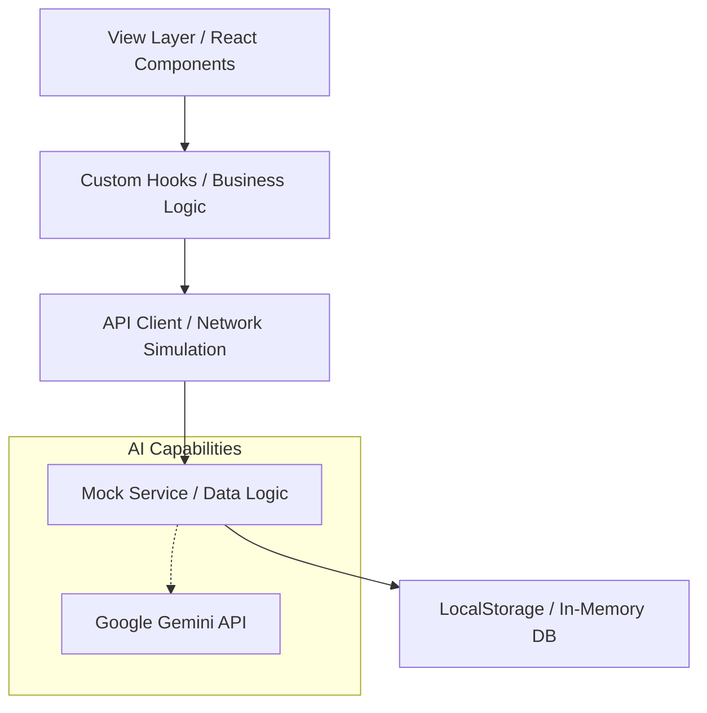

# 🧠 Collector + - Gamified Reading Platform

## 📋 项目简介 (Introduction)

**Collector +** 是一个探索未来的游戏化深度阅读平台，有效利用游戏化、多模态AI交互重构收藏夹内容阅读链路，让收藏内容高效消化、深度沉淀，打造“高效读，趣味传”的全场景阅读生态。

### 核心理念
*   **输入即博弈**：不再“收藏进灰”，而是通过 AI 生成的 Quiz 挑战来验证理解。
*   **认知切片化**：将长内容拆解为原子化的知识卡片，便于记忆与复盘。
*   **游戏化驱动**：引入 XP、连胜、等级系统，让深度学习像打怪升级一样上瘾。
*   **全链路闭环**：`导入` -> `解析` -> `阅读` -> `测验` -> `复盘` -> `数据沉淀`。

---

## 🛠️ 技术栈 (Tech Stack)

本项目采用现代化的前端技术栈构建，注重交互体验与视觉表现。

*   **Core Framework**: [React 19](https://react.dev/)
*   **Build Tool**: [Vite](https://vitejs.dev/)
*   **Language**: [TypeScript](https://www.typescriptlang.org/)
*   **Styling**: [Tailwind CSS](https://tailwindcss.com/) (CDN / Utility-first)
*   **Icons**: [Lucide React](https://lucide.dev/)
*   **AI Integration**: [Google GenAI SDK](https://ai.google.dev/) (Gemini Models)
*   **Architecture**: Client-side SPA with Mock API Layer

---

## 🏗️ 项目架构 (Architecture)

项目采用 **纯前端架构 (Client-Side Architecture)**，通过精心设计的 Mock API 层模拟后端行为，实现了完整的 CRUD 流程与数据持久化体验。



*   **View Layer**: 负责 UI 渲染与交互，采用响应式设计与高阶动画（3D 翻转、流体渐变）。
*   **Hooks Layer**: 封装业务逻辑（如 `useQuizSession`, `useDailyChallenge`），隔离 UI 与数据。
*   **Mock API Layer**: 在前端模拟完整的后端路由与数据库操作，支持网络延迟模拟，便于未来无缝迁移至真实后端。

---

## 📁 目录结构 (Directory Structure)

```bash
Read-AI-Gamified-Reading/
├── 📂 api/                 # 核心数据层 (Mock Backend)
│   ├── *Api.ts            # 模拟数据库操作与业务逻辑
│   ├── *Client.ts         # 模拟 HTTP 客户端请求
│   └── *Hooks.ts          # React Query 风格的自定义 Hooks
├── 📂 components/          # 公共 UI 组件
├── 📂 data/                # 静态模拟数据 (Mock Data)
├── 📂 views/               # 页面级视图组件
│   ├── Dashboard.tsx      # 仪表盘：任务入口与概览
│   ├── LibraryView.tsx    # 收录夹：多源内容管理
│   ├── ReaderView.tsx     # 阅读器：沉浸式阅读与侧边栏
│   ├── KnowledgeBase.tsx  # AI 卡片：知识切片与视觉化画廊
│   ├── AIQuizView.tsx     # AI 问答：测验、错题本与报告
│   ├── PodcastView.tsx    # AI 播客：音频化内容消费
│   ├── LearningData.tsx   # 数据中心：多维图表分析
│   └── SettingsView.tsx   # 个人中心与设置
├── 📂 server/              # (Optional) 本地开发服务器
├── App.tsx                 # 路由与全局布局
├── index.html              # 入口文件 (引入 Tailwind CDN)
└── package.json            # 依赖管理
```

---

## ⚡ 核心功能模块 (Core Features)

### 1. 🏠 仪表盘 (Dashboard)
*   **每日任务**：AI 每日推送 3 个基于历史阅读的认知挑战。
*   **快速导入**：支持 URL 一键导入（公众号/Medium/YouTube）。
*   **状态概览**：实时展示 XP、等级与今日进度。

### 2. 📚 智能收录夹 (Library)
*   **多源管理**：自动分类不同来源的内容。
*   **状态追踪**：待读、进行中、已完成、已归档。
*   **AI 预处理**：自动生成标签与核心摘要。

### 3. 🧠 AI 知识博弈 (AI Quiz)
*   **每日挑战**：游戏化的答题界面，支持连胜奖励。
*   **智能解析**：提交答案后即时反馈，提供“反直觉”的深度解析。
*   **错题本**：自动收集错题，支持定期复习与移除。
*   **学习报告**：生成本次会话的五维能力雷达图。

### 4. 🎴 知识切片画廊 (Knowledge Cards)
*   **视觉化呈现**：5 种动态视觉主题（极光紫、星空、纸质等）。
*   **3D 交互**：点击卡片翻转，查看 AI 深度反思与“反面视角”。
*   **社交分享**：生成包含二维码的高颜值海报，支持下载与传播。

### 5. 🎧 AI 播客 (Podcast)
*   **内容转音频**：将长文转化为对话式播客脚本。
*   **沉浸播放**：波形可视化与播放控制。
*   **关键点提炼**：播放时同步高亮核心观点。

### 6. 📊 全景数据 (Learning Analytics)
*   **热力矩阵**：GitHub 风格的学习投入度热力图。
*   **认知雷达**：深度、广度、逻辑、记忆、毅力五维评估。
*   **周期切换**：支持“本月/年度/全部”数据视图切换。

---

## ⚙️ 部署与运行 (Setup & Deployment)

### 前置要求
*   Node.js (v16+)
*   npm 或 yarn

### 本地开发

1.  **克隆项目**
    ```bash
    git clone https://github.com/your-repo/read-ai.git
    cd read-ai
    ```

2.  **安装依赖**
    ```bash
    npm install
    ```

3.  **启动开发服务器**
    ```bash
    npm run dev
    ```
    访问 `http://localhost:3000` 即可体验完整功能。

### 构建部署
```bash
npm run build
# 构建产物位于 dist/ 目录，可部署至 Vercel, Netlify 或 Nginx
```

---

## 🤝 贡献 (Contributing)
欢迎提交 Issue 或 Pull Request 来改进 Collector +！
目前的 Roadmap 包括：
- [ ] 接入真实的 Vector Database (如 Pinecone)
- [ ] 增加浏览器插件端 (Chrome Extension)
- [ ] 实现多人对战 Quiz 模式

---

<div align="center">
  <p>Made with ❤️ by Collector + Team</p>
</div>
