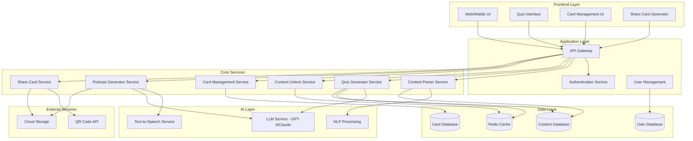

# Design Document: Read2Play

## Overview

Collector +是一个游戏化阅读平台，通过 AI 驱动的 Quiz 互动机制将传统的被动阅读转变为主动参与的游戏体验。系统的核心设计理念是利用心理学中的蔡格尼克效应（Zeigarnik Effect）和即时奖励机制，将长文阅读分解为一系列有趣的挑战，每次成功回答问题后解锁对应的文章片段作为奖励。

系统采用模块化架构，主要包含五个核心子系统：
1. **内容处理引擎** - 负责文章抓取、解析和存储
2. **AI Quiz 生成器** - 基于 LLM 生成趣味性问答
3. **知识卡片管理系统** - 实现类似 Flomo 的卡片化知识沉淀
4. **AI 播客生成器** - 将文章转换为对话式音频
5. **社交分享引擎** - 生成高颜值分享卡片

### Key Design Principles

- **游戏化优先**: 所有交互设计都围绕游戏化机制，确保用户体验的趣味性
- **渐进式解锁**: 内容通过 Quiz 逐步解锁，保持用户的好奇心和参与度
- **轻量化沉淀**: 借鉴 Flomo 的设计哲学，降低知识记录的心理负担
- **视觉驱动分享**: 分享卡片设计注重视觉冲击力，激发用户的分享欲望
- **AI 增强体验**: 利用 AI 能力提供多模态内容消费方式（文本、音频）

## Architecture

### System Architecture



### Technology Stack Recommendations

**Frontend**:
- React/Next.js for web application
- React Native for mobile apps
- TailwindCSS for styling
- Framer Motion for animations

**Backend**:
- Node.js with TypeScript for API services
- Express.js or Fastify for API framework
- Bull for job queues (podcast generation, quiz generation)

**AI Services**:
- OpenAI GPT-4 or Anthropic Claude for quiz generation and content analysis
- ElevenLabs or Google Cloud TTS for podcast generation
- Hugging Face Transformers for NLP tasks

**Database**:
- PostgreSQL for relational data (users, articles, cards)
- Redis for caching and session management
- S3-compatible storage for media files

**Infrastructure**:
- Docker for containerization
- Kubernetes or AWS ECS for orchestration
- CloudFront/CDN for content delivery

## Components and Interfaces

### 1. Content Parser Service

**Responsibility**: 从各种来源提取和解析文章内容

**Key Methods**:
```typescript
interface ContentParserService {
  // 从 URL 提取文章内容
  parseArticleFromUrl(url: string): Promise<ParsedArticle>;
  
  // 清理和格式化文章内容
  cleanContent(rawHtml: string): CleanedContent;
  
  // 提取文章元数据
  extractMetadata(content: string): ArticleMetadata;
  
  // 检测文章语言
  detectLanguage(content: string): string;
}
```

**Implementation Notes**:
- 使用 Mozilla Readability 或类似库进行内容提取
- 支持主流平台的特殊解析规则（微信公众号、知乎等）
- 实现回退机制：如果自动解析失败，允许用户手动粘贴内容

### 2. Quiz Generator Service

**Responsibility**: 基于文章内容生成趣味性 Quiz 卡片

**Key Methods**:
```typescript
interface QuizGeneratorService {
  // 生成 Quiz 卡片
  generateQuizzes(article: ParsedArticle, count: number): Promise<Quiz[]>;
  
  // 生成单个 Quiz
  generateSingleQuiz(contentFragment: string, style: QuizStyle): Promise<Quiz>;
  
  // 验证 Quiz 质量
  validateQuizQuality(quiz: Quiz): QualityScore;
  
  // 生成反常规解读
  generateUnconventionalInterpretation(article: ParsedArticle): Promise<string>;
}
```

**Quiz Generation Strategy**:
1. **内容分析**: 使用 LLM 识别文章的核心观点和关键片段
2. **问题生成**: 针对每个核心观点生成 1-2 个问题
3. **风格注入**: 为问题添加挑衅性或趣味性元素
4. **答案映射**: 将每个问题与对应的文章片段关联

**Prompt Engineering**:
```
你是一个创意问答设计师。基于以下文章片段，生成一个极具挑衅性或趣味性的选择题。

要求：
1. 问题要能激发好奇心，让人忍不住想知道答案
2. 选项设计要有迷惑性，但不能太难
3. 问题风格可以是：反直觉、挑战常识、幽默讽刺、哲学思辨
4. 避免直白的知识测试，要有游戏感

文章片段：{content_fragment}

输出格式：
{
  "question": "问题文本",
  "options": ["选项A", "选项B", "选项C", "选项D"],
  "correctAnswer": 0,
  "explanation": "为什么这个答案正确的解释",
  "style": "provocative|humorous|philosophical"
}
```

### 3. Content Unlock Service

**Responsibility**: 管理内容解锁逻辑和进度追踪

**Key Methods**:
```typescript
interface ContentUnlockService {
  // 解锁内容片段
  unlockFragment(userId: string, articleId: string, quizId: string): Promise<ContentFragment>;
  
  // 获取解锁进度
  getUnlockProgress(userId: string, articleId: string): Promise<UnlockProgress>;
  
  // 检查是否可以访问完整文章
  canAccessFullArticle(userId: string, articleId: string): Promise<boolean>;
  
  // 记录用户答题结果
  recordQuizAttempt(userId: string, quizId: string, isCorrect: boolean): Promise<void>;
}
```

**Unlock Logic**:
- 每个 Quiz 对应一个或多个内容片段
- 用户回答问题后（无论对错）都解锁对应片段
- 完成所有 Quiz 后解锁完整文章访问权限
- 使用 Redis 缓存解锁状态以提高性能

### 4. Card Management Service

**Responsibility**: 管理用户的知识卡片，实现类似 Flomo 的功能

**Key Methods**:
```typescript
interface CardManagementService {
  // 创建知识卡片
  createCard(userId: string, content: ContentFragment, reflection?: string): Promise<Card>;
  
  // 更新卡片思考
  updateCardReflection(cardId: string, reflection: string): Promise<Card>;
  
  // 获取用户的所有卡片
  getUserCards(userId: string, filters?: CardFilters): Promise<Card[]>;
  
  // 删除卡片
  deleteCard(cardId: string): Promise<void>;
  
  // 搜索卡片
  searchCards(userId: string, query: string): Promise<Card[]>;
}
```

**Card Data Structure**:
- 原文片段（只读）
- 个人思考（可编辑）
- 元数据（来源文章、创建时间、标签）
- 关联的 Quiz 信息

**UI Design Inspiration**:
- 借鉴 Flomo 的极简设计
- 卡片式布局，支持瀑布流展示
- 快速输入思考的浮动输入框
- 支持 Markdown 格式

### 5. Podcast Generator Service

**Responsibility**: 将文章转换为对话式播客

**Key Methods**:
```typescript
interface PodcastGeneratorService {
  // 生成播客脚本
  generatePodcastScript(article: ParsedArticle): Promise<PodcastScript>;
  
  // 将脚本转换为音频
  synthesizePodcast(script: PodcastScript): Promise<AudioFile>;
  
  // 获取播客生成状态
  getPodcastStatus(jobId: string): Promise<PodcastJob>;
}
```

**Podcast Generation Pipeline**:
1. **脚本生成**: 使用 LLM 将文章改写为对话式脚本
   - 两个虚拟主持人讨论文章内容
   - 保留核心观点，增加互动性和趣味性
   - 控制时长（建议 5-15 分钟）

2. **音频合成**: 使用 TTS 服务生成音频
   - 为两个主持人使用不同的声音
   - 添加适当的停顿和语气变化
   - 可选：添加背景音乐

3. **异步处理**: 播客生成是耗时操作，使用队列异步处理

**Prompt for Script Generation**:
```
你是一个播客脚本作家。将以下文章改写为两个主持人的对话式播客脚本。

要求：
1. 主持人A：好奇、提问者角色
2. 主持人B：知识渊博、解答者角色
3. 对话要自然流畅，有互动感
4. 保留文章的核心观点和关键信息
5. 时长控制在 10 分钟左右（约 1500-2000 字）
6. 开头要有吸引人的引入，结尾要有总结

文章内容：{article_content}

输出格式：
{
  "title": "播客标题",
  "duration_estimate": "10分钟",
  "script": [
    {"speaker": "A", "text": "对话内容"},
    {"speaker": "B", "text": "对话内容"}
  ]
}
```

### 6. Share Card Service

**Responsibility**: 生成高颜值的分享卡片

**Key Methods**:
```typescript
interface ShareCardService {
  // 生成分享卡片
  generateShareCard(card: Card, template: CardTemplate): Promise<ShareCard>;
  
  // 生成二维码
  generateQRCode(url: string, options: QRCodeOptions): Promise<string>;
  
  // 获取可用模板
  getAvailableTemplates(): Promise<CardTemplate[]>;
  
  // 自定义卡片样式
  customizeCardStyle(cardId: string, style: CardStyle): Promise<ShareCard>;
}
```

**Card Design Elements**:
- **布局**: 卡片式设计，黄金比例（3:4 或 4:5）
- **内容层次**:
  - 主标题/核心观点（大字体，醒目）
  - 文章片段（中等字体，可读性强）
  - 个人思考（小字体，区分颜色）
  - 二维码（固定位置，不抢眼但易扫描）
- **视觉元素**:
  - 渐变背景或纯色背景
  - 装饰性图形元素
  - 品牌标识（Collector +logo）
- **可定制选项**:
  - 背景颜色/渐变
  - 字体样式
  - 装饰元素

**Implementation**:
- 使用 Canvas API 或 Puppeteer 生成图片
- 预设多个高质量模板
- 支持用户自定义配色方案
- 二维码使用动态链接，支持追踪扫描数据

### 7. User Management & Gamification

**Responsibility**: 管理用户账户和游戏化激励系统

**Key Methods**:
```typescript
interface UserManagementService {
  // 获取用户统计数据
  getUserStats(userId: string): Promise<UserStats>;
  
  // 更新阅读连续天数
  updateReadingStreak(userId: string): Promise<number>;
  
  // 授予成就徽章
  awardBadge(userId: string, badgeType: BadgeType): Promise<void>;
  
  // 获取用户成就
  getUserAchievements(userId: string): Promise<Achievement[]>;
}
```

**Gamification Elements**:
- **阅读连续天数**: 每日完成至少一篇文章的 Quiz
- **成就徽章**: 
  - 首次完成文章
  - 连续阅读 7 天
  - 保存 10 张知识卡片
  - 分享 5 次卡片
- **统计数据**:
  - 已读文章数
  - 完成的 Quiz 数量
  - 保存的卡片数
  - 分享次数

## Data Models

### Article

```typescript
interface Article {
  id: string;
  userId: string;  // 收藏该文章的用户
  url: string;
  title: string;
  author?: string;
  source: string;  // 来源平台
  content: string;  // 清理后的正文
  rawContent: string;  // 原始 HTML
  metadata: ArticleMetadata;
  language: string;
  wordCount: number;
  estimatedReadTime: number;  // 预计阅读时间（分钟）
  status: 'pending' | 'parsed' | 'quiz_generated' | 'completed' | 'archived';
  createdAt: Date;
  updatedAt: Date;
}

interface ArticleMetadata {
  publishedDate?: Date;
  tags: string[];
  category?: string;
  coverImage?: string;
}
```

### Quiz

```typescript
interface Quiz {
  id: string;
  articleId: string;
  question: string;
  options: string[];
  correctAnswer: number;  // 正确答案的索引
  explanation: string;
  style: 'provocative' | 'humorous' | 'philosophical' | 'counterintuitive';
  relatedFragmentIds: string[];  // 关联的内容片段 ID
  difficulty: 'easy' | 'medium' | 'hard';
  order: number;  // 在文章中的顺序
  createdAt: Date;
}
```

### ContentFragment

```typescript
interface ContentFragment {
  id: string;
  articleId: string;
  content: string;
  startPosition: number;  // 在原文中的起始位置
  endPosition: number;
  isCore: boolean;  // 是否为核心片段
  relatedQuizIds: string[];
  createdAt: Date;
}
```

### Card (Knowledge Card)

```typescript
interface Card {
  id: string;
  userId: string;
  articleId: string;
  fragmentId: string;
  originalContent: string;  // 原文片段
  personalReflection?: string;  // 个人思考
  tags: string[];
  isFavorite: boolean;
  createdAt: Date;
  updatedAt: Date;
}
```

### UnlockProgress

```typescript
interface UnlockProgress {
  id: string;
  userId: string;
  articleId: string;
  unlockedFragmentIds: string[];
  completedQuizIds: string[];
  quizAttempts: QuizAttempt[];
  progress: number;  // 0-100 的百分比
  startedAt: Date;
  completedAt?: Date;
}

interface QuizAttempt {
  quizId: string;
  selectedAnswer: number;
  isCorrect: boolean;
  attemptedAt: Date;
}
```

### PodcastJob

```typescript
interface PodcastJob {
  id: string;
  articleId: string;
  userId: string;
  status: 'pending' | 'generating_script' | 'synthesizing_audio' | 'completed' | 'failed';
  script?: PodcastScript;
  audioUrl?: string;
  duration?: number;  // 音频时长（秒）
  error?: string;
  createdAt: Date;
  completedAt?: Date;
}

interface PodcastScript {
  title: string;
  durationEstimate: string;
  script: DialogueLine[];
}

interface DialogueLine {
  speaker: 'A' | 'B';
  text: string;
}
```

### ShareCard

```typescript
interface ShareCard {
  id: string;
  cardId: string;
  userId: string;
  imageUrl: string;
  qrCodeUrl: string;
  templateId: string;
  customStyle?: CardStyle;
  shareUrl: string;
  scanCount: number;
  createdAt: Date;
}

interface CardStyle {
  backgroundColor: string;
  gradientColors?: string[];
  fontFamily: string;
  accentColor: string;
  decorativeElements: string[];
}
```

### UserStats

```typescript
interface UserStats {
  userId: string;
  articlesRead: number;
  quizzesCompleted: number;
  cardsCreated: number;
  sharesCount: number;
  currentStreak: number;  // 当前连续天数
  longestStreak: number;  // 最长连续天数
  lastActiveDate: Date;
  achievements: Achievement[];
  updatedAt: Date;
}

interface Achievement {
  id: string;
  type: BadgeType;
  name: string;
  description: string;
  unlockedAt: Date;
}

type BadgeType = 
  | 'first_article'
  | 'streak_7'
  | 'streak_30'
  | 'cards_10'
  | 'cards_50'
  | 'shares_5'
  | 'quizzes_100';
```


## Correctness Properties

*属性（Property）是系统在所有有效执行中都应该保持为真的特征或行为——本质上是关于系统应该做什么的形式化陈述。属性是人类可读规范和机器可验证正确性保证之间的桥梁。*

### Property 1: Quiz 生成数量约束

*对于任何*文章，当 Quiz 生成器分析并生成 Quiz 时，返回的 Quiz 数量应该在 3 到 5 个之间（包含 3 和 5）。

**Validates: Requirements 1.1**

### Property 2: Quiz 包含有效选项

*对于任何*生成的 Quiz，它应该包含一个非空的选项列表，且正确答案索引应该在选项列表的有效范围内。

**Validates: Requirements 1.4**

### Property 3: 回答 Quiz 解锁对应片段

*对于任何* Quiz 和用户答案，当用户回答该 Quiz 后，Content Unlocker 应该返回与该 Quiz 关联的内容片段。

**Validates: Requirements 1.5, 2.1**

### Property 4: 解锁片段包含位置信息

*对于任何*解锁的内容片段，它应该包含在原文中的起始位置和结束位置信息。

**Validates: Requirements 2.2**

### Property 5: 完成所有 Quiz 解锁完整文章

*对于任何*文章和用户，当用户完成该文章的所有 Quiz 后，系统应该允许该用户访问完整文章内容。

**Validates: Requirements 2.3**

### Property 6: 解锁进度持久化（Round-trip）

*对于任何*用户和文章，保存解锁进度后再查询该进度，应该返回相同的已解锁片段列表和已完成 Quiz 列表。

**Validates: Requirements 2.5**

### Property 7: Keep 操作创建知识卡片

*对于任何*内容片段，当用户选择 Keep 该片段时，Card Manager 应该创建一个包含该片段内容和元数据的知识卡片。

**Validates: Requirements 3.2, 4.1**

### Property 8: Throw Away 操作隐藏内容

*对于任何*内容片段，当用户选择 Throw Away 该片段后，该片段不应该出现在用户的内容列表或推荐中。

**Validates: Requirements 3.3**

### Property 9: 创建卡片时思考字段可选

*对于任何*内容片段，创建知识卡片时不提供个人思考内容应该成功，且创建的卡片应该包含原文片段但思考字段为空。

**Validates: Requirements 3.5**

### Property 10: 卡片思考内容关联存储

*对于任何*知识卡片，创建时添加的个人思考内容应该与原文片段关联存储，查询该卡片时应该返回相同的思考内容。

**Validates: Requirements 4.2, 4.3**

### Property 11: 卡片思考可编辑

*对于任何*已存在的知识卡片，更新其个人思考内容后再查询，应该返回更新后的思考内容。

**Validates: Requirements 4.4**

### Property 12: 卡片按时间顺序排列

*对于任何*用户的知识卡片列表，查询返回的卡片应该按创建时间降序排列（最新的在前）。

**Validates: Requirements 4.6**

### Property 13: 完成阅读生成反常规解读

*对于任何*文章，当用户完成该文章的所有 Quiz 后，系统应该生成一个反常规解读内容。

**Validates: Requirements 5.1**

### Property 14: 播客生成返回音频文件

*对于任何*文章，当用户请求生成播客时，Podcast Generator 应该最终返回一个有效的音频文件 URL。

**Validates: Requirements 6.1**

### Property 15: 分享卡片包含二维码

*对于任何*知识卡片，生成分享卡片时，返回的卡片图片应该包含一个有效的二维码，且该二维码解码后应该是一个有效的 URL。

**Validates: Requirements 7.2, 7.6**

### Property 16: 自定义样式应用到分享卡片

*对于任何*知识卡片和自定义样式，使用该样式生成分享卡片后，卡片的样式属性应该与提供的自定义样式匹配。

**Validates: Requirements 7.5**

### Property 17: 每日推荐生成

*对于任何*活跃用户，系统每天应该生成至少一个文章推荐。

**Validates: Requirements 8.1**

### Property 18: 完成任务更新统计数据

*对于任何*用户，当用户完成一个 Quiz 或创建一个卡片后，查询用户统计数据应该反映这些操作（Quiz 完成数或卡片数增加）。

**Validates: Requirements 8.3**

### Property 19: 连续阅读授予徽章

*对于任何*用户，当用户的阅读连续天数达到特定阈值（如 7 天、30 天）时，系统应该授予对应的成就徽章。

**Validates: Requirements 8.4**

### Property 20: 添加文章到收藏列表

*对于任何*文章 URL，当用户添加该 URL 到稍后阅读列表后，查询用户的收藏列表应该包含该文章。

**Validates: Requirements 9.1**

### Property 21: 多种方式收藏文章

*对于任何*有效的文章来源（浏览器扩展、分享链接、直接输入），通过该来源添加文章应该成功，且文章应该出现在收藏列表中。

**Validates: Requirements 9.2**

### Property 22: 收藏列表显示必需信息

*对于任何*用户的收藏列表，返回的每篇文章应该包含标题、来源和收藏时间字段。

**Validates: Requirements 9.3**

### Property 23: 删除文章从列表移除

*对于任何*收藏列表中的文章，当用户删除该文章后，该文章不应该再出现在收藏列表中。

**Validates: Requirements 9.4**

### Property 24: 文章状态正确标记

*对于任何*文章，当 Quiz 生成完成后，文章状态应该标记为 'quiz_generated'；当用户完成所有 Quiz 后，状态应该标记为 'completed'。

**Validates: Requirements 9.5**

### Property 25: 文章解析过滤广告内容

*对于任何*包含常见广告标记（如 'advertisement', 'ad-container' 等 class）的 HTML 内容，解析后的正文不应该包含这些广告元素。

**Validates: Requirements 10.1**

### Property 26: 解析失败提供错误信息

*对于任何*无法成功解析的文章 URL，系统应该返回错误信息并提供手动输入内容的选项。

**Validates: Requirements 10.3**

### Property 27: 解析保留文章结构

*对于任何*文章，解析后的内容应该保留基本的结构信息（段落、标题、列表等），而不是纯文本。

**Validates: Requirements 10.4**

### Property 28: 解析提取元数据

*对于任何*文章，解析后应该提取并返回元数据对象，包含作者、发布时间、来源等字段（即使某些字段可能为空）。

**Validates: Requirements 10.5**

## Error Handling

### Quiz Generation Errors

**Scenario**: LLM 服务不可用或返回无效响应

**Handling**:
- 实现重试机制（最多 3 次，指数退避）
- 如果仍然失败，使用备用 LLM 服务
- 最终失败时，标记文章为 'pending' 状态，稍后重试
- 向用户显示友好的错误消息："Quiz 生成中遇到问题，我们稍后会重试"

**Scenario**: 生成的 Quiz 质量不佳（选项太少、问题不清晰等）

**Handling**:
- 实现 Quiz 质量验证函数
- 如果质量分数低于阈值，重新生成
- 记录低质量 Quiz 用于改进 prompt

### Content Parsing Errors

**Scenario**: 无法访问文章 URL（404、网络错误等）

**Handling**:
- 返回明确的错误类型（'url_not_found', 'network_error', 'timeout'）
- 提供手动粘贴内容的选项
- 对于临时错误（网络问题），支持重试

**Scenario**: 文章内容为非文本格式（PDF、视频等）

**Handling**:
- 检测内容类型
- 对于 PDF，使用 PDF 解析库提取文本
- 对于不支持的格式，提示用户并建议手动输入

**Scenario**: 解析后内容过短或过长

**Handling**:
- 过短（< 100 字）：警告用户内容可能不完整，询问是否继续
- 过长（> 50000 字）：提示用户文章较长，可能需要更多时间生成 Quiz

### Podcast Generation Errors

**Scenario**: TTS 服务失败或音频生成超时

**Handling**:
- 播客生成是异步的，失败不影响主要功能
- 更新 PodcastJob 状态为 'failed'，记录错误信息
- 允许用户重新请求生成
- 提供降级方案：纯文本版的播客脚本

### Card Management Errors

**Scenario**: 用户尝试 Keep 已经被 Throw Away 的内容

**Handling**:
- 允许操作，将内容从 'thrown_away' 状态恢复
- 这是合理的用户行为（改变主意）

**Scenario**: 存储空间不足或数据库错误

**Handling**:
- 捕获数据库异常
- 向用户显示错误："保存失败，请稍后重试"
- 记录错误日志用于监控

### Share Card Generation Errors

**Scenario**: 图片生成失败或二维码服务不可用

**Handling**:
- 重试机制（最多 2 次）
- 如果二维码服务失败，使用备用二维码生成库
- 最终失败时，提供纯文本分享链接作为降级方案

### General Error Principles

1. **用户友好的错误消息**: 避免技术术语，提供清晰的下一步建议
2. **优雅降级**: 核心功能失败时，提供替代方案
3. **错误日志**: 记录所有错误用于监控和调试
4. **重试策略**: 对于临时性错误，实现智能重试
5. **错误边界**: 使用 React Error Boundaries 防止 UI 崩溃

## Testing Strategy

### Dual Testing Approach

本项目采用**单元测试**和**基于属性的测试（Property-Based Testing, PBT）**相结合的策略，两者互补以实现全面的测试覆盖。

**单元测试**用于：
- 验证特定的示例和边界情况
- 测试组件之间的集成点
- 测试错误处理和异常情况
- 验证 UI 组件的渲染和交互

**基于属性的测试**用于：
- 验证在所有输入下都应该成立的通用属性
- 通过随机化实现全面的输入覆盖
- 发现边界情况和意外的输入组合
- 验证系统的不变量和一致性

### Property-Based Testing Configuration

**测试框架选择**: 
- JavaScript/TypeScript: **fast-check**
- Python (如果用于 AI 服务): **Hypothesis**

**配置要求**:
- 每个属性测试至少运行 **100 次迭代**（由于随机化）
- 每个测试必须引用设计文档中的属性编号
- 标签格式: `Feature: read2play, Property {number}: {property_text}`

**示例配置** (fast-check):
```typescript
import fc from 'fast-check';

describe('Feature: read2play, Property 1: Quiz 生成数量约束', () => {
  it('should generate 3-5 quizzes for any article', async () => {
    await fc.assert(
      fc.asyncProperty(
        articleArbitrary(),
        async (article) => {
          const quizzes = await quizGenerator.generateQuizzes(article, 5);
          expect(quizzes.length).toBeGreaterThanOrEqual(3);
          expect(quizzes.length).toBeLessThanOrEqual(5);
        }
      ),
      { numRuns: 100 }
    );
  });
});
```

### Test Organization

```
tests/
├── unit/
│   ├── services/
│   │   ├── content-parser.test.ts
│   │   ├── quiz-generator.test.ts
│   │   ├── card-manager.test.ts
│   │   └── share-card.test.ts
│   ├── components/
│   │   ├── QuizCard.test.tsx
│   │   ├── CardList.test.tsx
│   │   └── ShareCard.test.tsx
│   └── utils/
│       └── validation.test.ts
├── property/
│   ├── quiz-generation.property.test.ts
│   ├── content-unlock.property.test.ts
│   ├── card-management.property.test.ts
│   └── article-parsing.property.test.ts
├── integration/
│   ├── quiz-flow.integration.test.ts
│   ├── card-flow.integration.test.ts
│   └── share-flow.integration.test.ts
└── e2e/
    ├── reading-journey.e2e.test.ts
    └── gamification.e2e.test.ts
```

### Key Test Scenarios

#### Unit Tests

**Content Parser Service**:
- 测试解析微信公众号文章
- 测试解析知乎文章
- 测试处理 404 错误
- 测试过滤广告内容
- 测试提取元数据

**Quiz Generator Service**:
- 测试生成指定数量的 Quiz
- 测试 Quiz 包含有效选项
- 测试处理 LLM 服务错误
- 测试 Quiz 质量验证

**Card Manager Service**:
- 测试创建知识卡片
- 测试更新卡片思考
- 测试删除卡片
- 测试按时间排序
- 测试搜索卡片

**Share Card Service**:
- 测试生成分享卡片图片
- 测试嵌入二维码
- 测试应用自定义样式
- 测试处理生成失败

#### Property-Based Tests

**Property 1-5**: Quiz 生成和内容解锁
- 生成随机文章内容
- 验证 Quiz 数量、选项有效性、解锁逻辑

**Property 6**: 解锁进度持久化
- 生成随机解锁进度
- 验证 round-trip 一致性

**Property 7-12**: 知识卡片管理
- 生成随机内容片段和卡片
- 验证创建、更新、排序逻辑

**Property 13-16**: 高级功能
- 验证反常规解读生成
- 验证播客生成
- 验证分享卡片生成

**Property 17-24**: 用户管理和游戏化
- 生成随机用户行为序列
- 验证统计数据更新、徽章授予

**Property 25-28**: 文章解析
- 生成随机 HTML 内容
- 验证解析、过滤、元数据提取

#### Integration Tests

**Quiz Flow**:
1. 添加文章 → 生成 Quiz → 回答 Quiz → 解锁内容 → Keep/Throw Away
2. 验证整个流程的数据一致性

**Card Flow**:
1. Keep 内容 → 创建卡片 → 添加思考 → 编辑思考 → 查询卡片
2. 验证卡片数据的完整性

**Share Flow**:
1. 创建卡片 → 生成分享卡片 → 自定义样式 → 生成二维码
2. 验证分享卡片的所有元素

#### End-to-End Tests

**Reading Journey**:
- 模拟完整的用户阅读旅程
- 从添加文章到完成所有 Quiz 到保存卡片

**Gamification**:
- 模拟多日连续阅读
- 验证统计数据和徽章系统

### Test Data Generation

**Arbitraries for Property Tests** (fast-check):

```typescript
// 文章生成器
const articleArbitrary = () => fc.record({
  title: fc.string({ minLength: 10, maxLength: 100 }),
  content: fc.string({ minLength: 500, maxLength: 5000 }),
  author: fc.option(fc.string()),
  url: fc.webUrl(),
  language: fc.constantFrom('zh-CN', 'en-US'),
});

// Quiz 生成器
const quizArbitrary = () => fc.record({
  question: fc.string({ minLength: 10, maxLength: 200 }),
  options: fc.array(fc.string({ minLength: 5, maxLength: 100 }), { minLength: 2, maxLength: 6 }),
  correctAnswer: fc.nat(),
  explanation: fc.string({ minLength: 20, maxLength: 300 }),
});

// 内容片段生成器
const fragmentArbitrary = () => fc.record({
  content: fc.string({ minLength: 100, maxLength: 1000 }),
  startPosition: fc.nat(),
  endPosition: fc.nat(),
});

// 知识卡片生成器
const cardArbitrary = () => fc.record({
  originalContent: fc.string({ minLength: 100, maxLength: 1000 }),
  personalReflection: fc.option(fc.string({ minLength: 10, maxLength: 500 })),
  tags: fc.array(fc.string({ minLength: 2, maxLength: 20 }), { maxLength: 5 }),
});
```

### Mocking Strategy

**最小化 Mock 使用**:
- 优先使用真实实现进行测试
- 仅对外部服务（LLM API、TTS API、QR Code API）使用 mock
- 使用内存数据库（如 SQLite）进行数据库测试

**Mock 外部服务**:
```typescript
// Mock LLM 服务
const mockLLMService = {
  generateQuiz: jest.fn().mockResolvedValue({
    question: 'Mock question',
    options: ['A', 'B', 'C', 'D'],
    correctAnswer: 0,
    explanation: 'Mock explanation',
  }),
};

// Mock TTS 服务
const mockTTSService = {
  synthesize: jest.fn().mockResolvedValue({
    audioUrl: 'https://example.com/audio.mp3',
    duration: 600,
  }),
};
```

### Continuous Integration

**CI Pipeline**:
1. **Lint**: ESLint + Prettier
2. **Type Check**: TypeScript compiler
3. **Unit Tests**: Jest (快速反馈)
4. **Property Tests**: fast-check (更全面的覆盖)
5. **Integration Tests**: 测试服务间交互
6. **E2E Tests**: Playwright (仅在 PR 合并前运行)

**Coverage Goals**:
- 单元测试覆盖率: > 80%
- 关键路径（Quiz 生成、内容解锁、卡片管理）: > 90%
- 属性测试: 覆盖所有 28 个正确性属性

### Performance Testing

**Load Testing**:
- 测试并发 Quiz 生成请求
- 测试大量用户同时访问
- 测试数据库查询性能

**Benchmarks**:
- Quiz 生成时间: < 5 秒
- 内容解析时间: < 2 秒
- 卡片查询时间: < 100ms
- 分享卡片生成时间: < 3 秒

## Implementation Notes

### Phase 1: Core Reading Experience (MVP)
- 文章收藏和解析
- Quiz 生成和展示
- 内容解锁机制
- 基础的 Keep/Throw Away 功能

### Phase 2: Knowledge Management
- 完整的知识卡片系统
- 卡片编辑和管理
- 搜索和过滤功能

### Phase 3: Advanced Features
- AI 播客生成
- 反常规解读
- 高颜值分享卡片

### Phase 4: Gamification & Social
- 完整的游戏化系统
- 成就和徽章
- 社交分享和传播

### Security Considerations

1. **内容安全**: 
   - 对用户输入的 URL 进行验证
   - 防止 XSS 攻击（清理 HTML 内容）
   - 限制文章大小防止 DoS

2. **API 安全**:
   - 实现 rate limiting
   - 使用 JWT 进行身份验证
   - API key 管理（LLM、TTS 服务）

3. **数据隐私**:
   - 用户数据加密存储
   - 遵守 GDPR/数据保护法规
   - 提供数据导出和删除功能

### Scalability Considerations

1. **缓存策略**:
   - Redis 缓存 Quiz 和解锁状态
   - CDN 缓存分享卡片图片
   - 浏览器缓存静态资源

2. **异步处理**:
   - Quiz 生成使用队列
   - 播客生成使用后台任务
   - 分享卡片生成可异步

3. **数据库优化**:
   - 为常用查询添加索引
   - 使用数据库连接池
   - 考虑读写分离

### Monitoring and Observability

1. **关键指标**:
   - Quiz 生成成功率
   - 内容解析成功率
   - 用户完成率（完成所有 Quiz 的比例）
   - 卡片创建率（Keep vs Throw Away）

2. **日志记录**:
   - 结构化日志（JSON 格式）
   - 错误日志和堆栈跟踪
   - 性能日志（慢查询、慢 API）

3. **告警**:
   - LLM 服务失败率过高
   - 数据库连接池耗尽
   - API 响应时间过长
